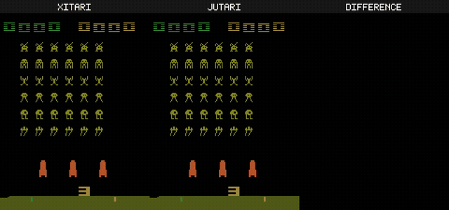

# Understanding VCS: XAI for the Atari Simulator via Differentiable Emulation



> **Space Invaders:** `xitari` (reference C++) · `jutari` (our Julia port) · **pixel difference**. The difference panel is solid black — the port reproduces the reference frame-for-frame.

### 📊 [Browse the results audit →](https://akmaier.github.io/UnderstandingVCS/)

A reproducibility and provenance dashboard for Papers 1 & 2: every claim traces to the exact
script, command, artifact, runtime, hardware, and the verifying conformance gate — so a reviewer
can confirm nothing is hand-waved. Built from [`docs/`](docs/) (`python3 docs/build_pages.py`).

## Project Overview

This project asks: **can modern XAI methods produce a hierarchical, mechanistic understanding of the Atari 2600 VCS — a system whose ground truth we fully possess?** It is directly inspired by Jonas & Kording's "Could a Neuroscientist Understand a Microprocessor?" (2017), but inverts the usual XAI experiment.

The conventional approach uses XAI to probe a black-box neural network (e.g., a DQN agent). This project flips the target: **the simulator itself becomes the XAI subject**. The DQN is, at most, a behaviour policy that drives the simulator into interesting states — we are not trying to explain the DQN.

To make XAI methods applicable to a classical hand-written C++ emulator, we are building **two differentiable, end-to-end ports of xitari** — one in **JAX (Python)** and one in **Julia**. Once the simulator is differentiable, gradient-based attribution, concept probing, mechanistic interpretability, and ablation analyses can be turned on it directly. Because we already know the true hierarchy (6507 CPU → TIA → RIOT → cartridge bank-switching → console), every XAI claim is testable against ground truth.

### Conceptual framing of the differentiable simulator

- **ROM as a hardwired neural network.** A cartridge ROM is a fixed bit pattern that the CPU "executes." Read as a tensor, it is the weight matrix of a network whose forward pass is one machine cycle. Backpropagating into ROM bytes asks "which bits explain this pixel?"
- **RAM as a Neural-Turing-Machine-like tape.** The 128 B of VCS RAM is small enough to carry as a differentiable state vector with soft (attention-style) read/write addressing. Unlike a vanilla NTM, the addressing is sometimes hard (direct, indexed) — we relax those into convex combinations only where gradients must flow.
- **Branches and case-selects as soft switches.** `if flag then PC+=offset` and opcode-indexed dispatch become gated mixtures (softmax / Gumbel-softmax / straight-through estimators). Forward behaviour stays bit-exact when the gates are saturated; gradients flow when they are relaxed.

This is the lever that lets us aim XAI tools at a system we already understand bit-for-bit.

---

## Current status

Both ports run a full VCS — CPU + Bus + RAM + TIA + RIOT + cart (2K, 4K, F8, F6, F4, F8SC, F6SC, F4SC, E0) — wrapped in an ALE-style `StellaEnvironment` (`reset` / `step(action)` / `get_screen` / `get_ram`). All **151 documented NMOS 6502 opcodes** + USBC + **37 common undocumented opcodes** (NOP/LAX/SAX) are implemented in both ports and in both execution modes (**HARD** = bit-exact uint8 dispatch, **SOFT** = differentiable float32 dispatch). The TIA renders playfield, both player sprites with NUSIZ multi-copy + 2×/4× scaling + VDELP shadow, both missiles, the ball with VDELBL, and all 8 collision latches; drives the framebuffer through VSYNC / VBLANK / VBLANK-output-blanking; supports HMOVE positioning + the floating-bus quirk on TIA reads. RIOT has the timer (4 prescalers, with INTIM-read-clears-flag P4d semantics) + I/O ports (SWCHA/SWCHB + DDRs, 2-player joystick wiring). Differentiability primitives (`RomTensor`, `soft_select`, `soft_memory_read`, `soft_branch`, straight-through round/clamp) are integrated end-to-end via `soft_step` / `soft_run` / `soft_run_scan`, with full Zygote support in jutari via the functional `_FUNC_HANDLERS` table.

### Conformance vs xitari (the bit-exact reference oracle) — jutari

The **jutari** (Julia) port is the conformance lead. Measured across **all 64
ALE-supported games** via the per-frame diff sweeps in `tools/rom_sweep/`:

| sweep | metric | result |
|---|---|---|
| **RAM** (`sweep_jutari_ram.py`) | 128 B RIOT RAM, per frame, NOOP from the standard 60-NOOP + 4-RESET boot | **64 / 64 BYTE-IDENTICAL to xitari** ✅ |
| **Screen** (`sweep_jutari_screen.py`) | 210×160 framebuffer, per frame, 60 frames | **64 / 64 pixel-exact** ✅ |

**jutari ≡ xitari, bit-for-bit, on all 64 ALE games — 64/64 RAM AND 64/64
screen.** The last game (elevator_action) closed via #121–#123: #121 fixed a genuine
jutari bug (`console_reset!` never reset the cart bank, so after the construction
probe jutari ran the wrong bank's reset/init code — xitari's `System::reset` resets
all devices); #122/#123 made the cart's Superchip-RAM init deterministic in both
emulators. xitari seeds that RAM from `time(NULL)` by default (ALE
`random_seed="time"`), and elevator's attract demo reads the *uninitialised* SC RAM
as a cheap RNG, so xitari was non-deterministic; pinning the seed to 0 in both
(jutari's `_sc_ram_lcg_init` mirrors xitari's exact LCG; xitari patch at
[tools/xitari_conformance_seed.patch](tools/xitari_conformance_seed.patch)) makes
the whole suite reproducible AND elevator pixel-exact. The render arc that took screen 44→64/64
ported xitari's actual per-color-clock object model (deferred RESP + reset-when +
skip-first-copy — including the HBLANK-RESP skip-first that closed up_n_down (#119),
the Cosmic Ark M0 bug, deferring the VDELP0/VDELP1/VDELBL
render-select flags — the master key that closed the whole VDELP/GRP-shadow family
at once — and latching the PF reflect bit at the left-half gate). Getting RAM to 64/64
required, among many fixes: per-game PAL display height + colour-loss, per-game
`Display.YStart` and `Emulation.HmoveBlanks`, the #106 partial-frame ("grey frame")
model, a double-buffered framebuffer (swap-not-clear, mirroring Stella), a VSYNC
hold-gate clock rebased across frame resets, and a faithful replay of xitari's
construction-time format-autodetect probe + double `reset_game` boot (which seeds
the free-running counters games never re-initialise). See
[bug_fix_log.md](bug_fix_log.md) for the full running history.

**~1950 tests green** across the two ports. **PXC1** (jaxtari/jutari ↔ xitari
trace) and **PXC2** (jaxtari ≡ jutari cross-check) are the in-repo conformance
harnesses. The **jaxtari** (JAX) port mirrors jutari but lags on the most recent
boot/render fixes (PAL height, HmoveBlanks, YStart, double-buffer, VSYNC-rebase,
construction-probe) — those are deferred to a jaxtari catch-up pass per the
jutari-first sequencing (jaxtari is ~205× slower, so it never blocks a jutari
deliverable).

For the per-phase commit ledger and the complete list of deferrals see
**[STATUS.md](STATUS.md)**; for the design rationale and pending phases see
**[PORTING_PLAN.md](PORTING_PLAN.md)**.

> **Conformance philosophy — match the deep runtime logic, not the scoreboard.**
> The objective is for the ports' TIA / CPU / RIOT to behave like xitari
> **mechanistically**. Fix the hard, structural divergences FIRST — the
> per-color-clock object mask model, RESP reset-when + skip-first-copy, the VDELP
> shadow latch, HMOVE position accumulation — even when a shallow per-pixel patch
> would raise the pixel-exact count faster. **Breaking a superficial / cosmetic fix
> is acceptable** if the change moves the runtime logic closer to xitari's: a
> temporary drop in the 45/64 screen (or even a RAM) score is fine when the
> underlying mechanism becomes faithful. Do **not** optimise the scoreboard with
> narrow special-cases — that masks the real divergence, and the XAI attribution
> (which projects gradients onto the framebuffer / RAM) needs the *true* mechanism,
> not a cosmetically-correct frame. Prefer porting xitari's actual algorithm over
> reproducing its output.
>
> **Agents working on emulation / conformance:** read **[bug_fix_log.md](bug_fix_log.md)** first — it's the running history of bugs hunted, patches landed, and dead-ends ruled out (e.g. the `bisect.py` stdlib-shadow gotcha). **Append to it** whenever you fix a bug or rule out a hypothesis, so the next agent inherits the context. The live conformance scoreboards are the 64-ROM sweep outputs under `tools/rom_sweep/` (`results_jutari_ram.md`, `results_jutari_screen.md`), regenerated by the sweep scripts.

### Throughput (engine × backend)

Soft-mode throughput on the real Pong ROM (soft mode, 3,000-step rollout, median
of repeated runs after JIT warm-up). **jutari** (Julia) executes one environment
with inlined opcode handlers; **jaxtari** (JAX) is slow per single environment
but recovers — and on the GPU far exceeds — that by `vmap`-batching the compiled
`lax.scan` rollout, its intended regime. Single-env rows are steps/s (= env-steps/s
at batch 1); batched rows are aggregate env-steps/s at their best batch (N ≈ 4096
on the GPU).

| engine & backend | mode | env-steps/s |
|---|---|---:|
| **jutari**, CPU | single env | 370,100 |
| **jaxtari**, CPU | single env | 1,178 |
| **jaxtari**, CPU | batched (`vmap`) | ~60,000 |
| **jaxtari**, GPU | batched (`vmap`) | **3,119,115** |

CPU is an Apple M1 Max core; the GPU figure is a commodity Quadro RTX 5000 (16 GB
Turing) — a GTX 1080 Ti (11 GB Pascal) traces the same curve and peaks at ~2.95M.
The single-env CPU gap (~314×) is JAX per-op kernel-launch overhead at
single-instruction granularity, not an AD-system difference; batching the compiled
rollout is how jaxtari is meant to be run, and the reverse-mode gradient costs only
~5% more at the GPU peak. The per-batch scaling (CPU and both GPUs, forward and
forward+gradient) and the full methodology are in the paper supplement under
[`jutari_paper/`](jutari_paper/).

---

## Hand-off — pick up here

**Latest (2026-06-16): jutari is 64/64 SCREEN pixel-exact AND 64/64 RAM bit-exact
vs xitari — all 64 ALE games match bit-for-bit. 🎉** The last game closed via
#121–#123 (cart-bank reset bug + deterministic Superchip-RAM seed; see the
conformance section above + bug_fix_log #121–#123). Earlier in the push: **#119**
closed up_n_down: an HBLANK
RESP strobe must still compute xitari's reset-when skip-first-copy (a far jump
75→3 → skip the first copy), and the skip-first scanline reset was moved from
scanline-start to scanline-end so the HBLANK RESP's value survives into the visible
region. **#121** fixed a genuine jutari bug — `console_reset!` never reset the cart
bank (xitari's `System::reset` resets all devices incl. `Cartridge::reset`), so
after the construction probe jutari ran the WRONG bank's reset/init code; a full
per-instruction register trace (jutari vs xitari) pinned it. **#122** then showed
the *sole* remaining game (elevator_action) is xitari's own non-determinism: the
attract demo reads `time(NULL)`-seeded uninitialised Superchip RAM as an RNG, so
xitari varies run-to-run and jutari (deterministic) can't match it — closing it
needs a methodology change (seed xitari + mirror its LCG). Following the "match the deep runtime logic, not the scoreboard"
philosophy, the player object renderer was ported to xitari's actual per-color-clock
model — **#115c**: deferred mid-scanline RESP + reset-when + skip-first-copy
(`PORT_OBJECT_RENDER_PLAN.md`). That closed **carnival** and slashed the
multiplexed-sprite games (robotank 241→148, up_n_down 221→86, berzerk 21→5) with
RAM still 64/64 and no exact-game regression. Earlier this session a 20-agent
color-attribution workflow diagnosed every render delta
([RENDER_DIVERGENCE_SYNTHESIS.md](RENDER_DIVERGENCE_SYNTHESIS.md)); #115 (RESMP
deferral → ice_hockey exact) and #115b (joystick INPT0-3 idle-low → air_raid
24→2px) also landed. **#115d/e** ported the Cosmic Ark M0 TIA-bug (journey_escape
325→3). **#115f** was the breakthrough: VDELP0/VDELP1/VDELBL were never in the
deferred-write set — pure render-select flags applied immediately, so a mid-scanline
VDELP write flipped live↔shadow GRP for the WHOLE scanline. Deferring them closed
journey_escape **and the entire VDELP/GRP-shadow family** at once (atlantis, amidar,
demon_attack, name_this_game, solaris, centipede, defender, jamesbond, pooyan,
asterix, air_raid) → **screen 46→59/64**, RAM still 64/64, no regression. The
earlier arc closed the last RAM divergences and several render ones (full diagnoses
in [bug_fix_log.md](bug_fix_log.md)):

- **qbert** — jutari was single-buffered; xitari/Stella double-buffers
  (swap-not-clear). Added `framebuffer_prev` + a completion-armed swap →
  qbert boot frame 7664 px → 0 (#114).
- **skiing** — `RAM[$00]` off-by-one: the VSYNC hold-gate clock was not rebased
  when `lines_since_frame` reset at the boot max-scanlines cutoff. Rebase it
  (xitari's absolute-clock semantics) → RAM 1 → 0.
- **surround** — `RAM[$7d]` (a free-running counter the game never re-inits) was
  95-short. xitari runs a 60-frame format-autodetect probe + the boot TWICE
  (the `ALEInterface` ctor's `reset_game` + the explicit `resetGame`) before
  episode 1; `env_reset!` now mirrors that (probe + keep-RAM double-boot) →
  RAM 7 → 0 AND screen 224 px → 0. **This took jutari RAM to 64/64.**

Diagnosis technique worth knowing: define `CpuDebug`/`TIADebug` in
`tools/trace_dump.cpp` to read xitari's protected CPU/TIA state without touching
the core; a temporary `fprintf` in an xitari core loop is acceptable for a
*reverted-after* diagnostic (e.g. decomposing a construction-time RAM seed).

### Open work — pick up here

**Pixel exactness is COMPLETE — screen 64/64, RAM 64/64.** All 64 ALE games are
both pixel-exact and byte-exact vs xitari. The last delta (elevator_action) closed
via #121–#123 (cart-bank reset bug + deterministic Superchip-RAM seed). The
diagnosis harness, if a future divergence appears, is
`tools/render_diff.py --rom <r> --frame <f> --auto` (color-attributes each diverging
pixel to a TIA object via the COLU registers, prints ENAM/RESMP/cosmic state, infers
per-frame height; needs xitari's `XI_POKE_DUMP` for true activations); plus the
per-instruction tracers `tools/full_instr_trace.jl` + `tools/instr_diff.py`.

Conformance now requires the deterministic-seed patch on the (git-excluded) xitari
reference: **[tools/xitari_conformance_seed.patch](tools/xitari_conformance_seed.patch)**
(pins `random_seed=0` + `Random::ourSeeded=true` so the Superchip-RAM init is
reproducible). Re-apply + rebuild xitari after any fresh xitari checkout.

The player object render is now faithful (per-color-clock RESP reset-when +
skip-first-copy, #115c; Cosmic Ark #115d/e), the VDELP/GRP-shadow FLAGS are deferred
(#115f), and PF reflect is left-half-latched (#115g). The remaining 3 are the
missile/ball HMOVE-accumulation + the GRP shadow-VALUE — next step: add per-scanline
`m0_x`/`bl_x`/`grp*_old` tracing to compare jutari's evolution vs xitari's
`myPOS*`/`myDGRP*`. Gate every change on the full screen + RAM sweep (run alone).

**jaxtari catch-up**: mirror the recent jutari boot/render fixes (PAL height,
HmoveBlanks, YStart, double-buffer, VSYNC-rebase, construction-probe) for PXC2
parity — deferred (jutari-first; jaxtari is ~205× slower, so it never blocks a
jutari deliverable).

### Test gates

```bash
# jutari unit tests (~20 s)
cd jutari && julia --project=. -e 'using Pkg; Pkg.test()'

# 64-ROM conformance sweeps — jutari vs xitari (~7 min each; run heavy gates alone)
jaxtari/.venv/bin/python tools/rom_sweep/sweep_jutari_ram.py    --jobs 6
jaxtari/.venv/bin/python tools/rom_sweep/sweep_jutari_screen.py --jobs 6 --frames 60

# jaxtari unit tests (~22 min in parallel)
cd jaxtari && .venv/bin/python -m pytest -q
```

### Comparison videos (xitari vs jutari / jaxtari)

[`tools/comparison_videos.py`](tools/comparison_videos.py) batch-renders an MP4 per
ALE game showing three panels side by side — **`xitari | <port> | DIFFERENCE`** —
both engines driven by the same actions, RomSettings and boot. The DIFFERENCE panel
(magenta = differing pixels) is **solid black** for a correct port, so the videos
visualise the 64/64 pixel-exactness directly. It wraps the per-ROM renderer
`tools/breakout_video/render_breakout_compare.py` over all 64 ROMs in
`tools/rom_sweep/roms/`. Needs `ffmpeg` on `PATH` and the built `tools/trace_dump`
(`cd tools && make`). Outputs land in `tools/comparison_videos/output/`
(git-ignored) as `<game>_xitari_vs_<port>.mp4`.

```bash
# all 64 games, xitari vs jutari, 10-second (600-frame @ 60 fps) clips:
jaxtari/.venv/bin/python tools/comparison_videos.py

# longer 30 s clips, 4 games rendered in parallel:
jaxtari/.venv/bin/python tools/comparison_videos.py --frames 1800 --jobs 4

# only specific games:
jaxtari/.venv/bin/python tools/comparison_videos.py --games elevator_action pong qbert

# also (or only) jaxtari — SLOW (~200x slower per frame; run later/in background):
jaxtari/.venv/bin/python tools/comparison_videos.py --port jaxtari   # xitari vs jaxtari
jaxtari/.venv/bin/python tools/comparison_videos.py --port both      # both ports
```

Key options: `--port {jutari,jaxtari,both}` (default `jutari`), `--frames N`
(default 600), `--games <stems…>` (default all 64), `--jobs N` (parallel games,
default 1), `--out-dir <dir>`, `--seed N`, `--keep-raw` (keep the large
intermediate frame dumps; they are deleted per-game by default). `python3` works in
place of the venv python for `--port jutari`; the jaxtari venv is only required for
`--port jaxtari`/`both`.

### Bug-bisection methodology

[BUG_BISECTION_METHODOLOGY.md](BUG_BISECTION_METHODOLOGY.md) — the per-bus-op trace
technique. Read it before chasing a new divergence.

---

## Repository Structure

```
UnderstandingVCS/
├── README.md                  # This file
├── PORTING_PLAN.md            # Phase plan + design rationale
├── STATUS.md                  # Per-phase commit/test/deferral ledger
├── bug_fix_log.md             # Running bug/patch history + open debugging ideas (agents: read & update)
├── P3I_G_THREADING_PLAN.md    # (historical) CPU↔TIA cycle-threading plan — landed; kept for context
├── tools/rom_sweep/           # 64-ROM conformance sweeps + live scoreboards (results_jutari_{ram,screen}.md)
├── .gitignore             # Excludes papers/, dqn/, xitari/ (external deps) and .DS_Store
├── literature/            # AI-readable markdown versions of papers with BibTeX (13 papers)
├── jaxtari/               # JAX port — see jaxtari/README.md
├── jutari/                # Julia port — see jutari/README.md
├── tools/                 # trace_dump.cpp sketch (xitari conformance helper, not built yet)
├── papers/                # PDF downloads (excluded from git, reproducible via DOIs)
├── dqn/                   # DeepMind DQN repository clone (excluded — used as black-box agent)
└── xitari/                # DeepMind Xitari (ALE fork) — the bit-exact reference (excluded)
```

`xitari/`, `dqn/`, and `papers/` are external dependencies, cloned/downloaded locally and not version-controlled here. `jaxtari/` and `jutari/` are the primary deliverables of this project and **are** version-controlled.

---

## Rules / Working Setup

### Developer Log Book via Commits

**Every command, change, or action performed in this project is committed and pushed to GitHub immediately after each turn.** The commit history serves as a complete developer log.

### Commit Message Format

Each commit message MUST include:
- **The full user prompt** that triggered the changes
- **The AI model used** (e.g., `claude-opus-4-7[1m]`)
- **A concise summary** of what was changed and why

This ensures reproducibility and full traceability.

### Literature Management

1. **papers/**: Downloaded PDFs. Excluded from git (binary, reproducible via URLs).
2. **literature/**: Markdown conversions with full text and a closing BibTeX block. Tracked in git.

### External Dependencies

The following live locally but are **excluded from git**:
- `dqn/` — DeepMind's DQN implementation (Lua/Torch). Used here as an *optional* black-box action source.
- `xitari/` — DeepMind's ALE fork. The **reference oracle** that the differentiable ports must match cycle-by-cycle.

---

## Key Papers and Their Role

### 1. Could a Neuroscientist Understand a Microprocessor? (Jonas & Kording, 2017)

**DOI**: [10.1371/journal.pcbi.1005268](https://journals.plos.org/ploscompbiol/article?id=10.1371/journal.pcbi.1005268)

**Core insight**: Standard neuroscience methods applied to a fully simulated MOS 6502 — with perfect data and ground truth — failed to recover the processor's hierarchical organisation. The bottleneck was the methods, not the data.

**Relevance**: This is our foundational paper. Where Jonas & Kording asked whether neuroscience methods could understand a microprocessor running an Atari game, we ask whether **XAI methods can understand the whole VCS** (CPU + TIA + RIOT + cart + ROM) once we expose it through gradients. The 6507 / VCS is our "known artifact." Any failure of XAI here is informative regardless of outcome.

### 2. Human-level Control through Deep Reinforcement Learning (Mnih et al., 2015)

**DOI**: [10.1038/nature14236](https://www.nature.com/articles/nature14236) · **arXiv**: [1312.5602](https://arxiv.org/abs/1312.5602)

**Relevance to the *new* project goal**: The DQN is **not** the XAI target. We use it (or any other agent) as a *policy* that drives the simulator into game-relevant trajectories, so that the XAI we run on the simulator is conditioned on realistic state distributions rather than random play. The original "explain the DQN" framing is preserved in the bibliography for context, but is no longer the research question.

---

## DQN and Xitari Breakdown

### DQN (Deep Q-Network)

**Source**: `https://github.com/google-deepmind/dqn`. Lua/Torch implementation of the Nature 2015 DQN. Treated here as a black-box action source. We do not modify or instrument it.

### Xitari (Arcade Learning Environment fork)

**Source**: `https://github.com/google-deepmind/xitari`. C++ Atari 2600 emulator based on Stella, with an ALE-style RL interface.

Top-level layout that the ports mirror:

| xitari path | Role | Port target |
|---|---|---|
| `emucore/m6502/src/` | 6502/6507 CPU (M6502, M6502Hi/Low, System) | `jaxtari/cpu/`, `jutari/src/cpu/` |
| `emucore/TIA.{cxx,hxx}` | Television Interface Adapter (video + audio) | `jaxtari/tia/`, `jutari/src/tia/` |
| `emucore/M6532.{cxx,hxx}` | RIOT: 128 B RAM + I/O + timer | `jaxtari/riot/`, `jutari/src/riot/` |
| `emucore/Cart*.{cxx,hxx}` | Cartridge / bank-switching types | `jaxtari/cart/`, `jutari/src/cart/` |
| `emucore/Console.{cxx,hxx}` | Top-level VCS console wiring | `jaxtari/console.py`, `jutari/src/Console.jl` |
| `emucore/Control.cxx`, `Joystick`, `Paddles`, `Switches` | Controllers + console switches | `jaxtari/io/`, `jutari/src/io/` |
| `environment/` | ALE-style RL wrapper, phosphor blend | `jaxtari/env/`, `jutari/src/env/` |
| `games/` | Per-game ROM scoring/termination rules | `jaxtari/games/`, `jutari/src/games/` |
| `controllers/` | Agent IPC (fifo, internal, rlglue) | Out of scope for ports (use direct API) |
| `agents/` | Sample agents | Out of scope for ports |

The full module-by-module plan, including the differentiability layer, the bit-exact test harness against xitari, and milestone phasing, is in **[PORTING_PLAN.md](PORTING_PLAN.md)**.

### Why Xitari is the right reference

Xitari is deterministic given a ROM, an action stream, and an RNG seed. That makes it a perfect oracle: every CPU register, every RAM byte, every TIA register, and every frame buffer the JAX/Julia ports produce can be compared byte-for-byte against xitari's trace for the same inputs. Disagreement is unambiguously a port bug.

---

## Project Plan and Hypotheses

### Core Hypothesis

> **A complete, differentiable port of the Atari VCS — where ROMs act as weights, RAM acts as a soft tape, and control flow acts as gated switches — lets us turn modern XAI methods on a system whose true mechanism is fully known. The mismatch between XAI explanations and the verified ground-truth hierarchy will quantify the methods' limits more sharply than any biological or neural-network target can.**

### Specific Questions

1. Can gradient-based attribution (Integrated Gradients, Grad-CAM analogues) localise the ROM bytes / RAM cells / TIA registers that "explain" a given pixel or score change?
2. Do concept probes (CAVs, network dissection analogues) recover known hardware concepts — bank-switch bits, sprite registers, collision latches, timer reloads?
3. Does mechanistic / circuit-style interpretability reconstruct the true hierarchy (instruction fetch → decode → ALU → bus → TIA/RIOT → frame) when the gates are relaxed?
4. How do the JAX and Julia ports compare on (a) throughput vs. xitari and (b) gradient-pass cost? Are the two languages' AD systems equivalent for this workload?
5. Where do soft-switch relaxations leak — i.e., for which instructions/branches does the differentiable version diverge from the bit-exact reference, and by how much?

### Methodology

1. **Port xitari to JAX and Julia, bit-exactly**, validated against per-cycle xitari traces. (See PORTING_PLAN.md.)
2. **Layer differentiability on top**, with a flag that toggles "hard / bit-exact" mode vs. "soft / differentiable" mode.
3. **Drive trajectories** with either random play, scripted actions, or a pre-trained DQN.
4. **Apply XAI methods** to ROM bytes, RAM cells, TIA registers, and intermediate CPU state.
5. **Compare to ground truth**: 6502 datasheet, TIA documentation, disassembly of the target ROM, known cartridge bank-switching schemes.

### Expected Outcomes

- **Best case**: XAI methods cleanly recover the documented VCS hierarchy on at least one game, validating the methods on a transparent target.
- **Likely case**: Methods recover *parts* of the hierarchy (e.g., correctly attribute a sprite pixel to a TIA player register) but miss higher-level structure (e.g., the game's score logic in ROM).
- **Worst / most informative case**: XAI produces confident, plausible, but **wrong** explanations on a system we can verify — a stronger version of Jonas & Kording's negative result.

---

## Bibliography

```bibtex
@article{Jonas2017Could,
  author    = {Jonas, Eric and Kording, Konrad Paul},
  title     = {Could a Neuroscientist Understand a Microprocessor?},
  journal   = {PLOS Computational Biology},
  year      = {2017},
  volume    = {13},
  number    = {1},
  pages     = {e1005268},
  doi       = {10.1371/journal.pcbi.1005268},
  issn      = {1553-7358},
  publisher = {Public Library of Science},
  url       = {https://journals.plos.org/ploscompbiol/article?id=10.1371/journal.pcbi.1005268}
}

@article{Mnih2015Human,
  author    = {Mnih, Volodymyr and Kavukcuoglu, Koray and Silver, David and Rusu, Andrei A. and Veness, Joel and Bellemare, Marc G. and Graves, Alex and Riedmiller, Martin and Fidjeland, Andreas K. and Ostrovski, Georg and Petersen, Stig and Beattie, Charles and Sadik, Amir and Antonoglou, Ioannis and King, Helen and Kumaran, Dharshan and Wierstra, Daan and Legg, Shane and Hassabis, Demis},
  title     = {Human-level control through deep reinforcement learning},
  journal   = {Nature},
  year      = {2015},
  volume    = {518},
  number    = {7540},
  pages     = {529--533},
  doi       = {10.1038/nature14236},
  publisher = {Nature Publishing Group},
  url       = {https://www.nature.com/articles/nature14236}
}

@article{Bellemare2013Arcade,
  author    = {Bellemare, Marc G. and Naddaf, Yavar and Veness, Joel and Bowling, Michael},
  title     = {The {Arcade} {Learning} {Environment}: An Evaluation Platform for General Agents},
  journal   = {Journal of Artificial Intelligence Research},
  year      = {2013},
  volume    = {47},
  pages     = {253--279}
}

@article{Graves2014NTM,
  author    = {Graves, Alex and Wayne, Greg and Danihelka, Ivo},
  title     = {Neural {Turing} {Machines}},
  journal   = {arXiv preprint arXiv:1410.5401},
  year      = {2014},
  url       = {https://arxiv.org/abs/1410.5401}
}
```

---

*This project is developed with AI assistance. Every change is committed and pushed to GitHub with full prompt and model documentation.*
